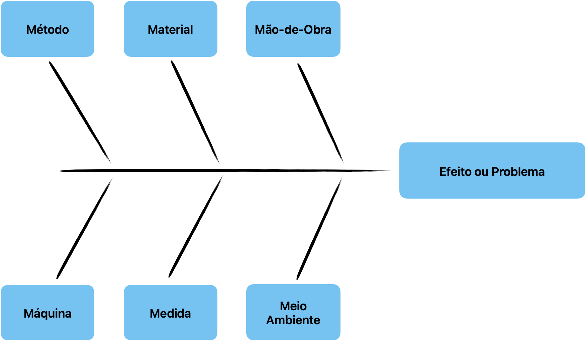

# Diagrama Espinha de Peixe

> Origem, Objetivo, Exemplos, VideoAula

::: details Vocabulário 
O diagrama espinha de peixe também é conhecido como:

Fishbone Diagram (termo em inglês)

Diagrama de Ishikawa

Diagrama de Causa e Efeito

6m
:::

## Origem e Objetivo
Foi originalmente proposto pelo engenheiro químico Kaoru Ishikawa em 1943 e aperfeiçoado nos anos seguintes. 

O diagrama te ajuda a identificar possíveis causas relacionadas a um efeito, ou seja, o que pode estar causando o efeito investigado.

## 6m

O Diagrama na sua forma tradicional, é composto por "seis pontas", onde cada uma representa um possível tipo de causa a ser identificada.

Todos os grupos de causas a serem mapeados, começam com a letra M, assim sendo, o diagrama também é conhecido como 6m.

## Significado de cada M

### Método
Toda a causa que envolve o método em que estava sendo executado o trabalho;

### Material
Toda causa que envolve o material que estava sendo utilizado no trabalho;

### Mão-de-obra
Toda causa que envolve uma atitude do profissional (ex: procedimento inadequado, pressa, imprudência, ato inseguro, etc.)

### Máquina
Toda causa envolvendo a máquina que estava sendo operada;

### Medida
Toda causa que envolve os instrumentos de medida, sua calibração, a efetividade de indicadores em mostrar as variações de resultado, se o acompanhamento está sendo realizado, se ocorre na frequência necessária, etc.

### Meio ambiente 
Toda causa que envolve o meio ambiente em si (poluição, calor, poeira, etc.) e, o ambiente de trabalho (layout, falta de espaço, dimensionamento inadequado dos equipamentos, etc.).

## Downloads

Modelo da Associação Americana de Qualidade: 
[Modelo Ishikawa - ASQ](https://asq.org/-/media/public/sixsigma/tools-exchange/fishbone-cause-and-effect-diagram.xls?la=pt)
