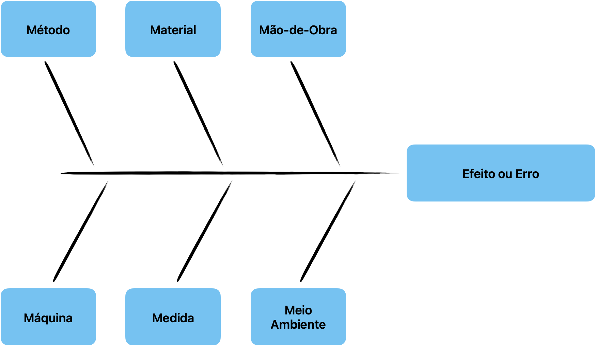

# Diagrama Espinha de Peixe

::: details Vocabulário 
O diagrama espinha de peixe também é conhecido como:

Fishbone Diagram (termo em inglês)

Diagrama de Ishikawa

Diagrama de Causa e Efeito

6m
:::

## Origem e Objetivo
Foi originalmente proposto pelo engenheiro químico Kaoru Ishikawa em 1943 e aperfeiçoado nos anos seguintes. 

O diagrama te ajuda a identificar possíveis causas relacionadas a um efeito, ou seja, o que pode estar causando o efeito investigado.

## 6m

O Diagrama na sua forma tradicional, é composto por "seis pontas", onde cada uma representa um tipo de causa a ser identificada.

### Significado de cada M

* Método: toda a causa envolvendo o método que estava sendo executado o trabalho;
* Material: toda causa que envolve o material que estava sendo utilizado no trabalho;
* Mão-de-obra: toda causa que envolve uma atitude do colaborador (ex: procedimento inadequado, pressa, imprudência, ato inseguro, etc.)
* Máquina: toda causa envolvendo a máquina que estava sendo operada;
* Medida: toda causa que envolve os instrumentos de medida, sua calibração, a efetividade de indicadores em mostrar as variações de resultado, se o acompanhamento está sendo realizado, se ocorre na frequência necessária, etc.
* Meio ambiente; toda causa que envolve o meio ambiente em si (poluição, calor, poeira, etc.) e, o ambiente de trabalho (layout, falta de espaço, dimensionamento inadequado dos equipamentos, etc.).
