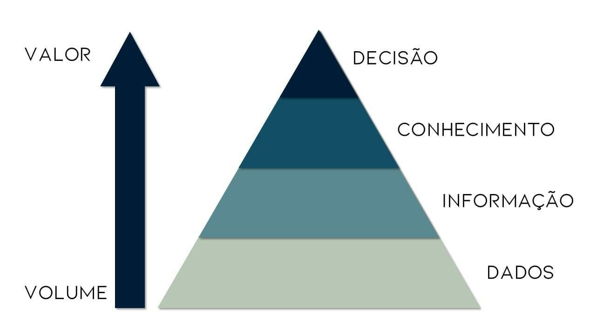
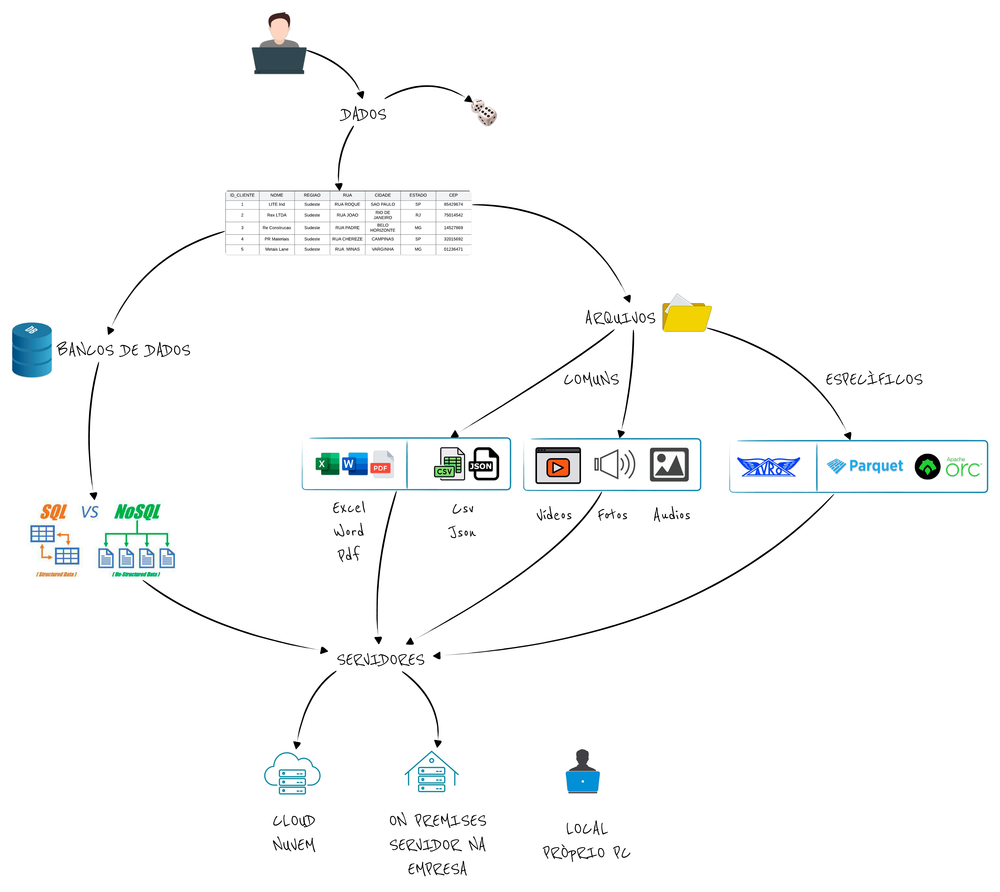

# Análise, Ciência de Dados e Inteligência Artificial

## Importância

:oil_drum: Os dados são o novo petróleo.

Você já usou essa expressão ou se perguntou o porque dessa analogia ?

Assim como o petróleo (sem refinamento, em seu estado bruto), os dados em si, como capturados, podem possuir pouco valor,
mas se trabalhados e analisados, podem ser aplicados das mais diversas maneiras possíveis.

---

:chart_with_upwards_trend: Dados possuem valor ?

Definitivamente, ainda mais importante é sempre ter em mente que, embora o dado cru também possua seu valor,
sua principal utilidade é servir como base para a **tomada de decisão**.

Seja essa decisão algo feito pelo homem, ou pela máquina, é este o objetivo final de qualquer operação em que se trabalhe com dados.

---

:earth_americas: Algo no mundo "real" precisa mudar, melhorar ou reagir ao conhecimento gerado através desse processo.

---

---

Utilizar ferramentas, processos, tecnologias, por si só, trazem pouco valor a organização.

Quando conseguimos impactar na velocidade com a qual reagimos a eventos, ou na assertividade de decisões que tomamos,
quando conseguimos tornar o negócio mais eficiente, neste momento, estamos agregando valor ao negócio.

::: tip Lembre-se

A tecnologia quase sempre é um meio, não um fim.

:::

## Dados

:thinking: Já parou para pensar quantos serviços e aplicativos que usamos são gratuítos ? 
Você realmente acha que é "de graça" ? 

:moneybag: Nossos dados possuem valor.

:floppy_disk: Eles são coletados por aplicativos e serviços, para posterior análise e uso.

> Se o serviço é de graça, o produto é você.

### Como são esses dados, onde ficam ?

:adult: Basicamente, tudo o que fazemos em meios digitais registram dados de uso. Quando nos cadastramos,
compramos algo, acompanhamos o rastreio de uma encomenda, acessamos algum site, procuramos algo no google...

:fire: Todas essas operações geram dados, que são armazenados, analisados e posteriormente utilizados de algum modo (geralmente comercial).

:mag_right: Quem nunca aqui digitou algum item no google, e depois recebeu anúncios "personalizados"?

A imagem abaixo mostra um pouco desse processo de armazenamento de dados. 
Nós como usuários geramos dados, que podem ser armazenados em banco de dados, ou em arquivos.
Esses dados podem ser armazenados tanto localmente (computador, celular, etc) quando em servidores.

Melhor visualização: <a href="data.pdf" target="_blank">PDF</a>

Para aqueles profissionais que desejem se aprofundar mais neste processo,
sugerimos conferir a seção sobre [Engenharia de Dados](/science/data-engineering)

## Análise e Ciência de Dados

Com todos esses dados que estão disponíveis atualmente, 
muitas organizações buscam maneiras de gerar valor através deles 
e com isto melhorarem seus negócios com tomadas de decisões mais assertivas. 

:bar_chart: A análise de dados é a disciplina que estuda a maneira de extrair informações úteis dos dados.

:test_tube: Já a ciência de dados é um campo é uma área mais abrangente, combinando estatística, matemática e programação para explorar e gerar novos dados de uma forma mais complexa.

|                          | Análise de Dados                     | Ciência de dados                                            |
| ------------------------ | ------------------------------------ | ----------------------------------------------------------- |
| O que faz                | Relatórios, Gráficos, Tendências     | Cria Padrões, Correlações, Predições                        |
| Principais Ferramentas   | BI(PowerBI, etc), Excel, Reports etc | Linguagens de Programação                                   |
| Fontes de Dados          | Muito bem estruturadas               | Diversas                                                    |
| Tempo                    | Passado -> O que?  porque? ...       | Futuro -> O que pode acontecer? o que podemos fazer?        |

## Inteligência Artificial

:robot: Impossível viver na atualidade sem ouvir falar em Inteligência Artificial (IA), certo ?
ChatGpt pra cá, Midjourney pra lá, extinção de trabalhos, skynet e apocalipse se aproximando ...

Modinhas e sensacionalismos a parte, a verdade é que o mundo está passando por outra revolução, 
e cabe a nós aceitarmos ou (não) esta nova realidade.

A Inteligência Artificial é um campo da ciência de dados que foca na criação de sistemas e 
algoritmos capazes de realizar tarefas que normalmente exigem inteligência humana,
como reconhecimento de fala, visão computacional, tomada de decisões, geração de imagens e audio, etc.

:technologist: Como um profissional 4.0, nosso objetivo é aprender a extrair o máximo dessas novas tecnologias,
aumentando ainda mais a produtividade do nosso dia a dia.

## Vocabulário

::: info Informações

Cloud = computação em servidores na "nuvem"

OnPremises = computação em servidores "locais"

SQL = tipo de banco de dados = banco de dados relacional

NoSQL = tipo de banco de dados = bancos de dados de: (chave/valor, grafos, documentos, etc)

csv, json, parquet, orc, avro, xlsx, doc, pdf = formatos de arquivos

:::